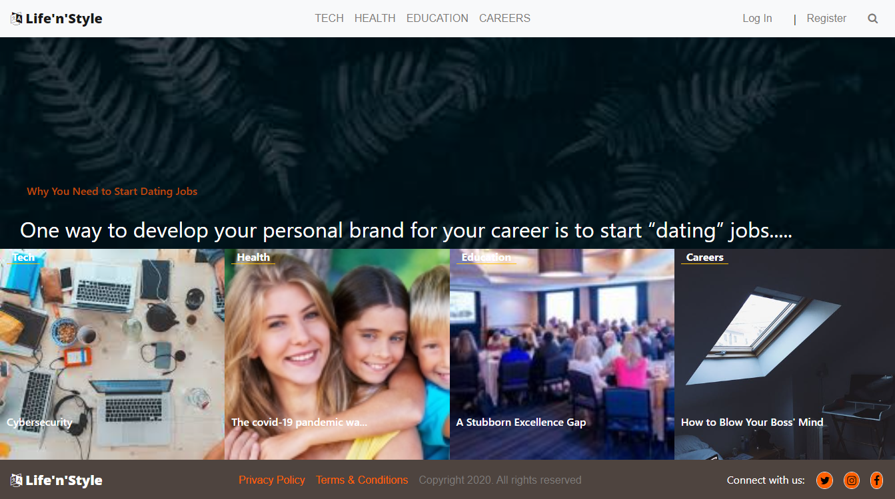

# README

 

# Life'n'Style app build in rails (users, articles, categories, vote and authentication)

The project is  build for the Ruby on Rails capstone and based on lifestyle articles website.

- The user logs in to the app, only by typing the username and password

> In this project, i built a `LifeStyle` app following the [Microverse](https://www.notion.so/Lifestyle-articles-b82a5f10122b4cec924cd5d4a6cf7561). 

## 

## Video Presentation:

[Watch life'n'style](https://www.loom.com/share/40606e58c8d94ecb998cb7d7c0b1226f)

## Link to Live host:

[Life'n'Style](https://lyfenstyle.herokuapp.com/)

## Built With

- Ruby
- Ruby on Rails
- Postgres
- Rspec
- Bootstrap
- html
- css

## Extra Ruby gems

- devise
- shoulda

## Deployed on:

- Heroku

## Feature upgrades:

- Create the frontend where users can create and write an article.
- signup and logout.

## Prerequisities

To get this project up and running locally, you must have ruby, sqlite3, postgress, yarn and node installed on your computer.

## Getting Started

**To get this project set up on your local machine, follow these simple steps:**

**Step 1** 
Navigate through the local folder where you want to clone the repository and run
`git clone https://github.com/uimarshall/rails-capstone-LifeStyles.git`. 
**Step 2** 
Run `cd rails-capstone-LifeStyles`. 
**Step 3** 
Run `bundle install` to install the gems from the `Gemfile`. 
**Step 4** 
Run `yarn install` to install the packages from the `package.json` file. 
**Step 5** 
Run `rake db:create` to create your local database.
**Step 6** 
Run `rake db:migrate` to migrate your local database.
**Step 7** 
Run `rake db:seed` to migrate your local database.
**Step 8** 
Run `rails serve` to start the rails server.
**Step 9** 
You can navigate to `http://localhost:3000/` to see your application running 

## Authors

👤 **Marshall Akpan**

- Github: [uimarshall](https://github.com/uimarshall)
- Twitter: [uimarshall](https://twitter.com/uimarshall)
- Linkedin: [Marshall Akpan](https://www.linkedin.com/in/marshall-akpan-19745526/)

## 🤝 Contributing

Our favourite contributions are those that help us improve the project, whether with a contribution, an issue, or a feature request!

Feel free to check the [issues page](https://github.com/uimarshall/rails-capstone-LifeStyles/issues) to either create an issue or help us out by fixing an existing one.

## Show your support

If you've read this far....give us a ⭐️!

## :clap: Acknowledgements

- Microverse
- creativecommons
- [Nelson Sakwa](https://www.behance.net/sakwadesignstudio) on [Behance](https://www.behance.net/)

## 📝 License

This project is licensed by Microverse and the Odin Project

- ...
